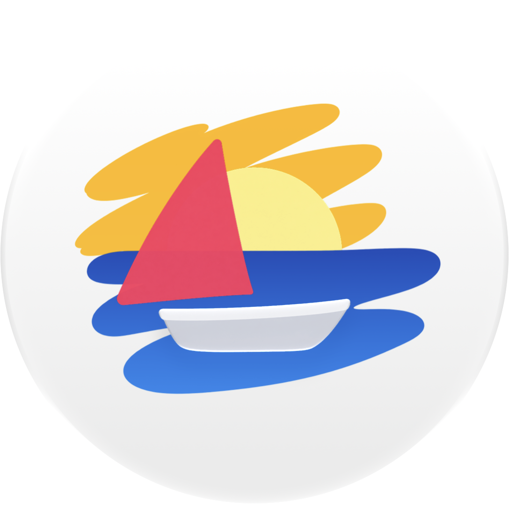

<p align="center">
  
</p>

<h1 align="center">Paint Anytime</h1>

<p align="center">
  A drawing app made specifically for Apple Watch.
</p>

<p align="center">
  Sketch an idea, doodle while you're waiting, or create a tiny piece of art right from your wrist.
</p>

<p align="center">
  <a href="https://github.com/denis-kolchev/Paint-Anytime/releases/tag/v1.0.0">
    <strong>Latest Release — v1.0.0</strong>
  </a>
</p>

## Screenshots

<table>
  <tr>
    <td align="center">
      
    </td>
    <td align="center">
      
    </td>
    <td align="center">
      
    </td>
    <td align="center">
      
    </td>
  </tr>

  <tr>
    <td align="center">
      
    </td>
    <td align="center">
      
    </td>
    <td align="center">
      
    </td>
    <td align="center">
      
    </td>
  </tr>
</table>

## Features

- 5 brush presets with unique drawing behaviors;
- Custom colors, stroke width, and angle;
- Canvas zoom for more precise drawing;
- Regular eraser and object eraser;
- Undo and Redo;
- Clear the entire canvas with one tap;
- Save drawings to your personal gallery;
- Continue editing saved drawings later;
- Share your drawings through iMessage or email.

## Requirements

- Apple Watch
- watchOS 10.0 or later
- Xcode with watchOS development support for building from source

## Build from Source

Clone the repository:

```bash
git clone https://github.com/denis-kolchev/Paint-Anytime.git
```

Open the project in Xcode, select your Apple Developer Team under **Signing & Capabilities**, select an Apple Watch or watchOS Simulator as the destination, and build the project.

Depending on your signing configuration, you may need to use your own Bundle Identifier.

## Releases

The first public release is **Paint Anytime 1.0.0**.

[View Paint Anytime v1.0.0 →](https://github.com/denis-kolchev/Paint-Anytime/releases/tag/v1.0.0)

Source archives for each release are generated automatically by GitHub.

## Documentation

- [Privacy Policy](docs/PRIVACY.md) — local data, sharing, Photos, and support
- [Localization](docs/LOCALIZATION.md) — language selection and translation workflow
- [Contributing](docs/CONTRIBUTING.md) — pull requests and contributor agreement
- [Licensing](docs/LICENSING.md) — source code and official App Store builds

## License

Copyright © 2026 Denis Kolchev.

The source code of Paint Anytime is open source and licensed under the GNU Affero General Public License version 3 only (`AGPL-3.0-only`), unless explicitly stated otherwise. See [LICENSE](LICENSE) for the full terms.

Official builds distributed by Denis Kolchev through the Apple App Store are licensed separately under the [Apple Standard EULA](https://www.apple.com/legal/internet-services/itunes/dev/stdeula/).

Third-party components retain their applicable licenses.

See [LICENSING.md](docs/LICENSING.md) for additional licensing information.
